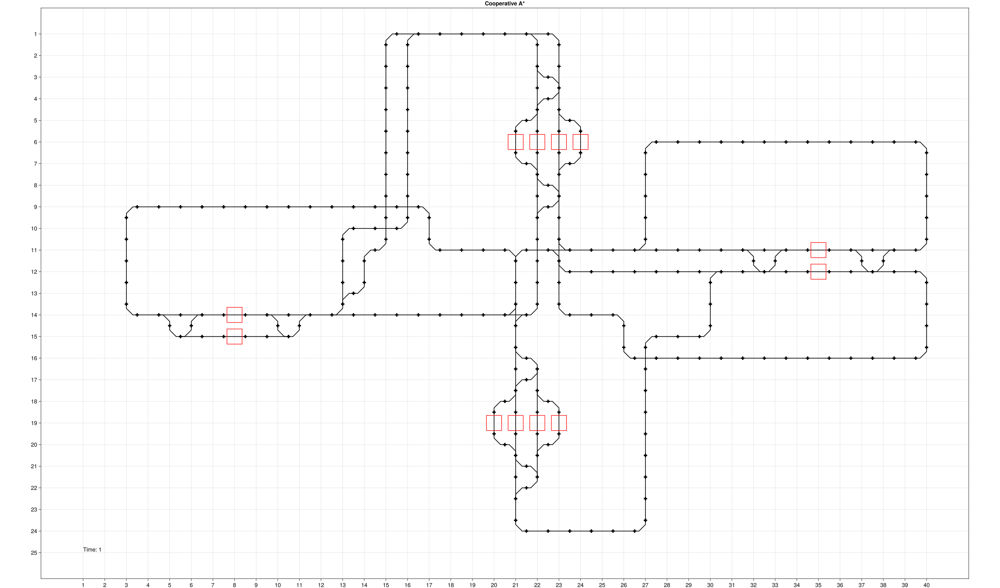

```@meta
CurrentModule = Flatland
```

# Flatland.jl

This package is an interface between the algorithms from [MultiAgentPathFinding.jl](https://github.com/gdalle/MultiAgentPathFinding.jl) and the instance generator from the [Flatland challenge](https://www.aicrowd.com/challenges/flatland-3)[^1][^2].

[^1]: [*Flatland-RL : Multi-Agent Reinforcement Learning on Trains*](https://arxiv.org/abs/2012.05893), Mohanty et al. (2020)

[^2]: [*Flatland Competition 2020: MAPF and MARL for Efficient Train Coordination on a Grid World*](https://proceedings.mlr.press/v133/laurent21a.html), Laurent et al. (2021)

